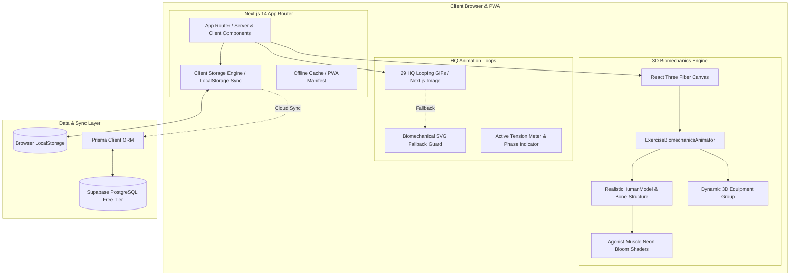
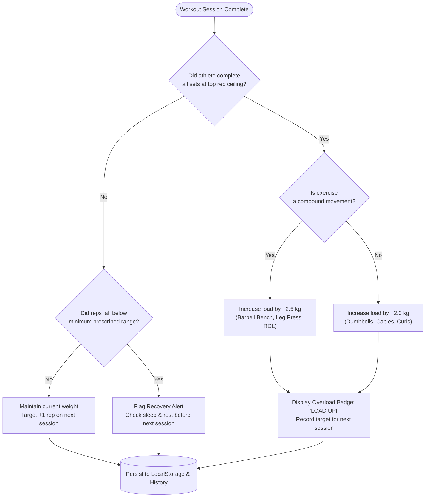
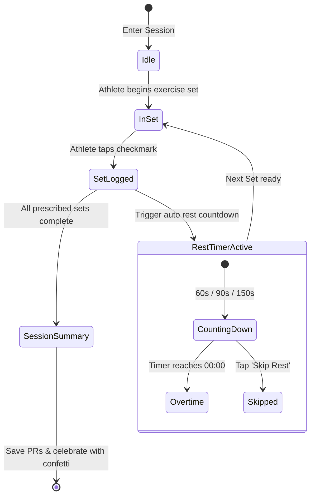

# 🏛️ GYM X &middot; Architecture, Flows & Engineering Specifications

This document outlines the technical architecture, data pipelines, 3D rendering lifecycle, and progressive overload mechanics of the **GYM X** fitness application.

---

## 1. High-Level System Architecture



---

## 2. 3D Biomechanics & Kinematics Pipeline

### 2.1 Joint Hierarchical Tree & Kinematic Matrix
The 3D model articulates through hierarchical reference transforms defined in [`RealisticHumanModel.tsx`](src/components/3d/RealisticHumanModel.tsx):

```
Root Group (position: [0, -0.2, 0])
 └── Torso Group (ref: torsoRef, position: [0, 0.4, 0])
      ├── Head & Cranium (position: [0, 1.45, 0])
      ├── Pectoralis Major (3 Heads: Clavicular, Sternal, Costal)
      ├── Latissimus Dorsi V-Taper Wings (Left & Right)
      ├── 6-Pack Rectus Abdominis & External Obliques
      ├── Left Shoulder Joint (ref: leftShoulderRef, position: [-0.48, 1.15, 0])
      │    ├── Deltoid Cap (Anterior, Lateral, Posterior)
      │    ├── Biceps Brachii & Triceps Brachii
      │    └── Left Elbow Joint (ref: leftElbowRef, position: [0, -0.46, 0])
      │         ├── Forearm & Brachioradialis
      │         └── Hand Grip
      ├── Right Shoulder Joint (ref: rightShoulderRef, position: [0.48, 1.15, 0])
      │    ├── Deltoid Cap
      │    ├── Biceps Brachii & Triceps Brachii
      │    └── Right Elbow Joint (ref: rightElbowRef, position: [0, -0.46, 0])
      │         ├── Forearm & Brachioradialis
      │         └── Hand Grip
      └── Lower Body Pelvis (position: [0, 0.35, 0])
           ├── Left Leg Joint (ref: leftLegRef, position: [-0.18, 0, 0])
           │    ├── Quadriceps & Vastus Medialis Teardrop
           │    ├── Hamstrings (Posterior Thigh)
           │    ├── Knee Joint
           │    └── Calves (Gastrocnemius Bellies) & Foot
           └── Right Leg Joint (ref: rightLegRef, position: [0.18, 0, 0])
                ├── Quadriceps & Vastus Medialis Teardrop
                ├── Hamstrings (Posterior Thigh)
                ├── Knee Joint
                └── Calves (Gastrocnemius Bellies) & Foot
```

### 2.2 Smooth Kinematic Interpolation Loop
Every frame in [`ExerciseBiomechanicsAnimator.tsx`](src/components/3d/ExerciseBiomechanicsAnimator.tsx) evaluates a deterministic trigonometric rep curve:

$$\theta(t) = \frac{\sin(t \cdot \omega) + 1}{2}$$

Where:
- $\omega = 1.4 \times \text{playbackSpeed}$ (slow, instructional tempo: ~3.2 seconds per full rep).
- When $\theta = 0$: **Eccentric Peak Stretch** (bar on chest, sled deep at 90°, hips hinged back).
- When $\theta = 1$: **Concentric Peak Lockout** (arms extended, sled driven upward, hips locked forward).

Joint angles are smoothed each frame via linear interpolation (`THREE.MathUtils.lerp`) at a factor of `0.18` to eliminate jitter:

$$\text{rotation}_{n} = \text{lerp}(\text{rotation}_{n-1}, \text{targetAngle}, 0.18)$$

### 2.3 Muscle Emissive Glow Shader Pipeline
Active agonists glow dynamically using Three.js `MeshStandardMaterial` emissive properties:
- **Base Color**: `#2a0e04`
- **Emissive Color**: `#ee4d00` (GYM X Fiery Orange)
- **Emissive Intensity**:
  $$I_{\text{glow}} = 0.8 + 2.2 \times \text{contractionIntensity}$$
  When an athlete performs a bench press, the pectoral muscle heads pulse from $1.1$ up to $3.0$ intensity at the peak concentric squeeze.

---

## 3. Progressive Overload Decision Engine



### 3.1 1RM Epley Estimation Formula
To track neuromuscular strength progression across arbitrary rep ranges:

$$\text{1RM} = \text{Weight} \times \left(1 + \frac{\text{Reps}}{30}\right)$$

Example:
- Hussain benches $30\text{ kg} \times 10\text{ reps} \implies 30 \times (1 + 10/30) = 40.0\text{ kg Estimated 1RM}$.
- Upon advancing to $32.5\text{ kg} \times 8\text{ reps} \implies 32.5 \times (1 + 8/30) = 41.17\text{ kg Estimated 1RM}$ (+2.9% strength gain).

---

## 4. Live Workout Logger & Rest Timer State Machine



### 4.1 Gym Dead-Zone LocalStorage Persistence
To protect users in underground gyms or poor cellular areas, the application syncs session state on every interaction:
1. `apex_active_workout`: In-flight active set data, weight inputs, timestamps.
2. `apex_workout_history`: Completed session logs, set volumes, estimated 1RMs.
3. `apex_personal_records`: Lifetime best loads by exercise ID.
4. `apex_health_metrics`: Daily bodyweight, 7-day rolling average, hydration, and sleep.

---

## 5. Visual Asset Generation Pipeline

```mermaid
graph LR
    PythonScript[generate_all_23_exercise_gifs.py] --> PILCanvas[PIL High-Res Canvas 560x420]
    PILCanvas --> StudioLighting[Studio Radial Floor Spotlight & Embers]
    StudioLighting --> BoneMath[Biomechanic Kinematic Angles]
    BoneMath --> MuscleBloom[Multi-Layer Agonist Neon Bloom]
    MuscleBloom --> HUDBar[Top Active Tension & Bottom Cue HUD]
    HUDBar --> GIFExporter[Animated GIF Exporter 28 frames @ 115ms]
    GIFExporter --> PublicDir[public/exercises/]
    PublicDir --> NextImage[Next.js Image Component in /workout]
```



- **Resolution**: 560 &times; 420 px.
- **Color Depth**: Quantized 256-color palette with alpha blending.
- **Duration**: 28 frames &times; 115ms = **3,220ms per rep cycle**.
- **File Footprint**: Optimized between 110 KB and 168 KB per GIF for rapid mobile caching.
